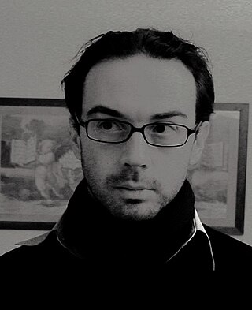
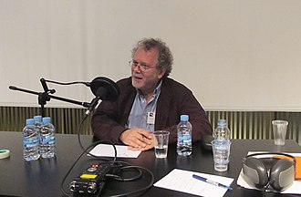
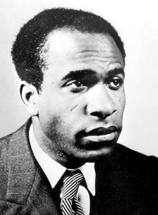
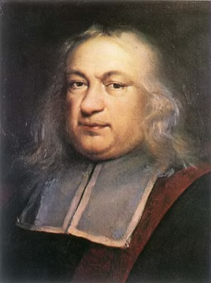
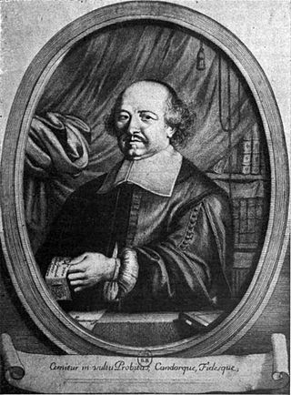

# Peter Abelard

Peter Abelard was a medieval French scholastic philosopher, leading logician, theologian, teacher, musician, composer, and poet.

# Sylviane Agacinski

Sylviane Agacinski-Jospin is a French philosopher, feminist, author, professor at the École des hautes études en sciences sociales (EHESS), and wife of Lionel Jospin, former Prime Minister of France. Her theoretical articulation of parity inspired the French law which requires every political party to fill 50 percent of all candidacies in every seat with women.

# Pierre d'Ailly

Pierre d'Ailly was a French theologian, astrologer and cardinal of the Roman Catholic Church.

# Alain (philosopher)

Émile-Auguste Chartier, commonly known as Alain, was a French philosopher, journalist, essayist, pacifist, and teacher of philosophy.

.jpg)

# Ferdinand Alquié

Ferdinand Alquié was a French philosopher and member of the Académie des Sciences Morales et Politiques from 1978.

# Louis Althusser

Louis Pierre Althusser was a French Marxist philosopher who studied at the École Normale Supérieure in Paris, where he eventually became Professor of Philosophy.

# Antoine Arnauld

Antoine Arnauld was a French Catholic theologian, priest, philosopher and mathematician. He was one of the leading intellectuals of the Jansenist group of Port-Royal and had a very thorough knowledge of patristics. Contemporaries called him le Grand to distinguish him from his father.

# Raymond Aron

Raymond Claude Ferdinand Aron was a French philosopher, sociologist, political scientist, historian and journalist, one of France's most prominent thinkers of the 20th century.

# Gwenaëlle Aubry

Gwenaëlle Aubry is a French novelist and philosopher.

# Pierre Hyacinthe Azaïs

Pierre Hyacinthe Azaïs was a French philosopher.

# Gaston Bachelard

Gaston Bachelard was a French philosopher. He made contributions in the fields of poetics and the philosophy of science. To the latter, he introduced the concepts of epistemological obstacle and epistemological break. He influenced many subsequent French philosophers, among them Michel Foucault, Louis Althusser, Dominique Lecourt and Jacques Derrida, as well as the sociologists Pierre Bourdieu and Bruno Latour.

# Alain Badiou

Alain Badiou is a French philosopher, formerly chair of Philosophy at the École normale supérieure (ENS) and founder of the faculty of Philosophy of the Université de Paris VIII with Gilles Deleuze, Michel Foucault and Jean-François Lyotard. Badiou's work is heavily informed by philosophical applications of mathematics, in particular set theory and category theory. Badiou's "Being and Event" project considers the concepts of being, truth, event and the subject defined by a rejection of linguistic relativism seen as typical of postwar French thought. Unlike his peers, Badiou openly believes in the idea of universalism and truth. His work is notable for his widespread applications of various conceptions of indifference. Badiou has been involved in a number of political organisations, and regularly comments on political events. Badiou argues for a return of communism as a political force.

# Bonaventure

Bonaventure was an Italian Catholic Franciscan bishop, cardinal, scholastic theologian and philosopher.

# Étienne Balibar

Étienne Balibar is a French philosopher. He has taught at the University of Paris X, at the University of California, Irvine and is currently an Anniversary Chair Professor at the Centre for Research in Modern European Philosophy (CRMEP) at Kingston University and a visiting professor at the Department of French and Romance Philology at Columbia University.

# Jules Barthélemy-Saint-Hilaire

Jules Barthélemy-Saint-Hilaire was a French philosopher, journalist, statesman, and possible illegitimate son of Napoleon I of France.

# Roland Barthes

Roland Gérard Barthes was a French literary theorist, essayist, philosopher, critic, and semiotician. His work engaged in the analysis of a variety of sign systems, mainly derived from Western popular culture. His ideas explored a diverse range of fields and influenced the development of multiple schools of theory, including structuralism, anthropology, literary theory, and post-structuralism.

# Victor Basch

Basch Viktor Vilém, or Victor-Guillaume Basch was a French Jewish politician and professor of germanistics and philosophy at the Sorbonne descending from Hungary. He was engaged in the Zionist movement, in the Ligue des droits de l'homme and in Anti-Nazism.

# Frédéric Bastiat

Claude-Frédéric Bastiat was a French economist, writer and a prominent member of the French liberal school.

# Georges Bataille

Georges Albert Maurice Victor Bataille was a French philosopher and intellectual working in philosophy, literature, sociology, anthropology, and history of art. His writing, which included essays, novels, and poetry, explored such subjects as eroticism, mysticism, surrealism, and transgression. His work would prove influential on subsequent schools of philosophy and social theory, including post-structuralism.

# Charles Batteux

Charles Batteux was a French philosopher and writer on aesthetics.

# Jean Baudrillard

Jean Baudrillard was a French sociologist and philosopher with an interest in cultural studies. He is best known for his analyses of media, contemporary culture, and technological communication, as well as his formulation of concepts such as hyperreality. Baudrillard wrote about diverse subjects, including consumerism, critique of economy, social history, aesthetics, Western foreign policy, and popular culture. Among his most well-known works are Seduction (1978), Simulacra and Simulation (1981), America (1986), and The Gulf War Did Not Take Place (1991). His work is frequently associated with postmodernism and specifically post-structuralism. Nevertheless, Baudrillard had also opposed post-structuralism, and had distanced himself from postmodernism.

# Louis Eugène Marie Bautain

Louis Eugène Marie Bautain, was a French philosopher and theologian.

# Pierre Bayle

Pierre Bayle was a French philosopher, author, and lexicographer. He is best known for his Historical and Critical Dictionary, whose publication began in 1697. Many of the more controversial ideas in the book were hidden away in the voluminous footnotes, or they were slipped into articles on seemingly uncontroversial topics. Bayle is commonly regarded as a forerunner of the Encyclopédistes of the mid-18th century.

# Jean Beaufret

Jean Beaufret was a French philosopher and Germanist tremendously influential in the reception of Martin Heidegger's work in France.

# Simone de Beauvoir

Simone Lucie Ernestine Marie Bertrand de Beauvoir was a French existentialist philosopher, writer, social theorist, and feminist activist. Though she did not consider herself a philosopher, nor was she considered one at the time of her death, she had a significant influence on both feminist existentialism and feminist theory.

# Julien Benda

Julien Benda was a French philosopher and novelist, known as an essayist and cultural critic. He is best known for his short book, La Trahison des Clercs from 1927.

# Alain de Benoist

Alain de Benoist, also known as Fabrice Laroche, Robert de Herte, David Barney, and other pen names, is a French political philosopher and journalist, a founding member of the Nouvelle Droite, and the leader of the ethno-nationalist think tank GRECE.

# Daniel Bensaïd

Daniel Bensaïd was a philosopher and a leader of the Trotskyist movement in France. He became a leading figure in the student revolt of 1968, while studying at the University of Paris X-Nanterre.

# Nikolai Berdyaev

Nikolai Alexandrovich Berdyaev was a Russian philosopher, theologian, and Christian existentialist who emphasized the existential spiritual significance of human freedom and the human person. Alternative historical spellings of his surname in English include "Berdiaev" and "Berdiaeff", and of his given name "Nicolas" and "Nicholas".

# Henri Bergson

Henri-Louis Bergson was a French philosopher who was influential in the traditions of analytic philosophy and continental philosophy, especially during the first half of the 20th century until the Second World War, but also after 1966 when Gilles Deleuze published Le Bergsonisme. Bergson is known for his arguments that processes of immediate experience and intuition are more significant than abstract rationalism and science for understanding reality.

# Gilles Bernheim

Gilles Uriel Bernheim is a French-Israeli rabbi who was formerly the Chief Rabbi of France. Born in Aix-les-Bains, Savoie, in 1952, he was elected by the general assembly of the Central Consistory chief rabbi of France on 22 June 2008, for a seven-year mandate starting from 1 January 2009. Until then, he had been rabbi of synagogue de la Victoire, the main synagogue in Paris, since 1 May 1997. The Chief Rabbi of France was respected as a scholar not only in the Jewish community but in the wider academic world. However, he resigned as chief rabbi in April 2013 before his term had ended, amid revelations of plagiarism and deception about his academic credentials.

# François Bernier

François Bernier was a French physician and traveller. He was born in Joué-Etiau in Anjou. He stayed for around 12 years in India.

# Abdennour Bidar

Abdennour Bidar is a French writer and philosopher of Islamic culture.

# Jacques Bidet

Jacques Bidet is a French philosopher and social theorist who is currently professor emeritus in the Philosophy Department at the Université de Paris X - Nanterre.

# Paul Ricœur

Jean Paul Gustave Ricœur was a French philosopher best known for combining phenomenological description with hermeneutics. As such, his thought is within the same tradition as other major hermeneutic phenomenologists, Martin Heidegger, Hans-Georg Gadamer, and Gabriel Marcel. In 2000, he was awarded the Kyoto Prize in Arts and Philosophy for having "revolutionized the methods of hermeneutic phenomenology, expanding the study of textual interpretation to include the broad yet concrete domains of mythology, biblical exegesis, psychoanalysis, theory of metaphor, and narrative theory."

# Maine de Biran

François-Pierre-Gontier de Biran, usually known as Maine de Biran, was a French philosopher.

# Antoine Blanc de Saint-Bonnet

Antoine Blanc de Saint-Bonnet was a French philosopher, whose ideas were a precursor to modern sociology.

# Maurice Blanchot

Maurice Blanchot was a French writer, philosopher and literary theorist. His work, exploring a philosophy of death alongside poetic theories of meaning and sense, bore significant influence on post-structuralist philosophers such as Gilles Deleuze, Michel Foucault, Jacques Derrida and Jean-Luc Nancy.

# Maurice Blondel

Maurice Blondel was a French philosopher, whose most influential works, notably L'Action, aimed at establishing the correct relationship between autonomous philosophical reasoning and Christian belief.

# Louis de Bonald

Louis Gabriel Ambroise, Vicomte de Bonald was a French counter-revolutionary philosopher and politician. He is mainly remembered for developing a theoretical framework from which French sociology would emerge.

# Jean Borella

Jean Borella is a Christian philosopher and theologian. Borella's works are inspired by Ancient and Christian Neoplatonism, but also by the Traditionalist School of René Guénon and Frithjof Schuon.

# Célestin Bouglé

Célestin Charles Alfred Bouglé was a French philosopher and sociologist known for his role as one of Émile Durkheim's collaborators and a member of the L'Année Sociologique.

# Francisque Bouillier

Francisque Bouillier was a French philosopher, born in Lyons. He studied at the École Normale Supérieure, Paris, and in 1839 was appointed professor of philosophy at the University of Lyons. From 1849 to 1864 he was dean of the faculty at Lyons and from 1867 to 1870 director of the École Normale Supérieure. His works include:Histoire et critique de la révolution cartésienne (1842)
Théorie de la raison impersonnelle (1844)
Du principe vital et de l'âme pensante (1862)
Du plaisir et de la douleur (1865)
La vraie conscience (1882)
Souvenirs d'un vieil universitaire (1897)

# Pierre Bourdieu

Pierre Bourdieu was a French sociologist and public intellectual. Bourdieu's contributions to the sociology of education, the theory of sociology, and sociology of aesthetics have achieved wide influence in several related academic fields. During his academic career he was primarily associated with the School for Advanced Studies in the Social Sciences in Paris and the Collège de France.

# Dominique Bourg

Dominique Bourg is a French philosopher. Since 2006, he is professor at the Faculty of Geosciences and Environment of the University of Lausanne (Switzerland).

# Pierre Boutang

Pierre Boutang was a French philosopher, poet and translator. He was also a political journalist, associated with the currents of Maurrasianism and Royalism.

# Émile Boutroux

Étienne Émile Marie Boutroux was an eminent 19th-century French philosopher of science and religion, and a historian of philosophy. He was a firm opponent of materialism in science. He was a spiritual philosopher who defended the idea that religion and science are compatible at a time when the power of science was rising inexorably. His work is overshadowed in the English-speaking world by that of the more celebrated Henri Bergson. He was elected membership of the Academy of Moral and Political Sciences in 1898 and in 1912 to the Académie française.

# Jacques Bouveresse

Jacques Bouveresse was a French philosopher who wrote on subjects including Ludwig Wittgenstein, Robert Musil, Karl Kraus, philosophy of science, epistemology, philosophy of mathematics and analytical philosophy. Bouveresse was called "an avis rara among the better known French philosophers in his championing of critical standards of thought."

# Charles de Bovelles

Charles de Bovelles was a French mathematician and philosopher, and canon of Noyon. His Géométrie en françoys (1511) was the first scientific work to be printed in French.

# Rémi Brague

Rémi Brague is a French historian of philosophy specializing in Islamic, Jewish, and Christian thought of the Middle Ages. He is professor emeritus of Arabic and religious philosophy at the Sorbonne and Romano Guardini chair of philosophy (emeritus) at the Ludwig Maximilian University of Munich.

# Victor Brochard

Victor Charles Louis Brochard was a French philosopher and historian of philosophy.

# Fabienne Brugère

Fabienne Brugère is a French philosopher specializing in aesthetics and philosophy of art, history of modern philosophy, moral and political philosophy, Anglo-American philosophy studies and feminist theory. She was a professor at the Bordeaux Montaigne University and vice-president for international relations at this university. She joined the Paris 8 University Vincennes-Saint-Denis since September 2014, as chair of "philosophy of modern and contemporary arts". She has been president of the Paris Lumières University Group since November 2019, after having chaired the academic council of this institution.

# Christine Buci-Glucksmann

Christine Buci-Glucksmann is a French philosopher and Professor Emeritus from University of Paris VIII specializing in the aesthetics of the Baroque and Japan, and computer art. Her best-known work in English is Baroque Reason: The Aesthetics of Modernity.

# Jean Buridan

Jean Buridan was an influential 14th‑century French philosopher.

# Pierre Jean Georges Cabanis

Pierre Jean Georges Cabanis was a French physiologist, freemason and materialist philosopher.

# Jean-Yves Calvez

Jean-Yves Calvez was a French Jesuit, theologian, philosopher, economist, expert in Marxism and professor of social philosophy.

# Albert Camus

Albert Camus was a French philosopher, author, dramatist, journalist, world federalist, and political activist. He was the recipient of the 1957 Nobel Prize in Literature at the age of 44, the second-youngest recipient in history. His works include The Stranger, The Plague, The Myth of Sisyphus, The Fall and The Rebel.

# Georges Canguilhem

Georges Canguilhem was a French philosopher and physician who specialized in epistemology and the philosophy of science.

# Monique Canto-Sperber

Monique Canto-Sperber is a French philosopher. Her works, translated in several languages, are focused on ethics and contemporary political issues. A former director of the École normale supérieure from 2005 to 2012, she has been president of Paris Sciences et Lettres – Quartier latin, a French higher education and research institution, since 2012.

# Ricciotto Canudo

Ricciotto Canudo was an early Italian film theoretician who lived primarily in France. In 1913, he published a bimonthly avant-garde magazine entitled Montjoie!, promoting Cubism in particular. Involved in numerous movements yet confined to none, Canudo exuded seemingly boundless energy. He ventured into poetry, penned novels, and established open-air theatre in southern France. As an art critic, he unearthed talents like Chagall, curating a Chagall exhibition in 1914. In that same year, alongside Blaise Cendrars, he issued a call for foreigners residing in France to enlist in the French army. Among the 80,000 who responded was Canudo himself.

# Albert Caraco

Albert Caraco was a French-Uruguayan philosopher, writer, essayist and poet of Turkish Jewish descent. He is known for his two major works, Post Mortem (1968) and posthumously published Bréviaire du chaos (1982). He is often compared to the philosophers and writers such as Emil Cioran, Louis-Ferdinand Céline, Nicolás Gómez Dávila and Friedrich Nietzsche.

# Elme Marie Caro

Elme Marie Caro was a French philosopher.

# Maxence Caron

Maxence Caron is a French writer, poet, philosopher and musicologist.

# Barbara Cassin

Barbara Cassin is a French philologist and philosopher. She was elected to the Académie française on 4 May 2018. Cassin is the recipient of the Grand Prize of Philosophy of the Académie française. She is an emeritus Research Director at the National Center for Scientific Research (CNRS) in Paris. Cassin is a program Director at the International College of Philosophy and the director of its Scientific Council and member of its board of directors. She was a director of Collège international de philosophie established by Jacques Derrida. In 2006 she succeeded Jonathan Barnes to the directorship of the leading centre of excellence in Ancient philosophy, Centre Leon-Robin, at the Sorbonne. In recent years she has been teaching seminars and writing books in partnership with Alain Badiou.

# Charles-Irénée Castel de Saint-Pierre

Charles-Irénée Castel, abbé de Saint-Pierre was a French author.

# Cornelius Castoriadis

Cornelius Castoriadis was a Greek-French philosopher, social critic, economist, psychoanalyst, author of The Imaginary Institution of Society, and co-founder of the Socialisme ou Barbarie group.

# Jean Cavaillès

Jean Cavaillès was a French philosopher and logician who specialized in philosophy of mathematics and philosophy of science. He took part in the French Resistance within the Libération movement and was arrested by the Gestapo on 17 February 1944 and shot on 4 April 1944.

# Vincent Cespedes

Vincent Cespedes is a French philosopher, writer and composer.

# Félicien Challaye

Félicien Robert Challaye was a French philosopher, anti-colonialist and human rights activist.

# Georges Chapouthier

Georges Chapouthier is a French neuroscientist and philosopher.

# Bernard Charbonneau

Bernard Charbonneau was a French writer who wrote about twenty books and numerous articles, published in La Gueule Ouverte, Foi et Vie, La République des Pyrénées. An apolitical and independent thinker, he is considered to be a major inspiration for various French ecological movements. His name is regularly mentioned by French academics. as well French green party leaders.

# Daniel Charles

Daniel Paul Charles was a French musician, musicologist and philosopher. He was born on 27 November 1935 in Oran (Algeria) and died on 21 August 2008 in Antibes (France).

# Pierre Charron

Pierre Charron was a French Catholic theologian and major contributor to the new thought of the 17th century. He is remembered for his controversial form of skepticism and his separation of ethics from religion as an independent philosophical discipline.

# Amalric of Bena

Amalric of Bena was a French theologian, philosopher and sect leader, after whom the Amalricians are named. Reformers such as Martin Luther considered him to be a proto-Protestant.

# François Châtelet

Michel François Jacques Châtelet was a historian of philosophy and political philosophy, philosopher and professor in the socratic tradition. He was the husband of philosopher Noëlle Châtelet. Châtelet was also a co-founder of the influential French political philosophy journal Arguments.

# Emil Cioran

Emil Mihai Cioran was a Romanian philosopher, aphorist and essayist, who published works in both Romanian and French. His work has been noted for its pervasive philosophical pessimism, style, and aphorisms. His works frequently engaged with issues of suffering, decay, and nihilism. In 1937, Cioran moved to the Latin Quarter of Paris, which became his permanent residence, wherein he lived in seclusion with his partner, Simone Boué, until his death in 1995.

# Jean Clam

Jean Clam is a philosopher, sociologist and psychologist. He is Research Fellow at the Centre national de la recherche scientifique (CNRS), Paris, presently affiliated to the Ecole des Hautes Etudes en Sciences Sociales (EHESS) in Paris. His numerous researches deal mainly with sociology and psychology of intimacy, legal theory and general theory of the human and social sciences.

# Catherine Clément

Catherine Clément is a French philosopher, novelist, feminist, and literary critic, born in Boulogne-Billancourt. She received a degree in philosophy from the École Normale Supérieure, and studied under its faculty Claude Lévi-Strauss and Jacques Lacan, working in the fields of anthropology and psychoanalysis. A member of the school of French feminism and écriture féminine, she has published books with Hélène Cixous and Julia Kristeva. She has also made contributions to musicology; her Opera, or the Undoing of Women (1979) is notable for its emphasis on the representation of women in opera.

# Auguste Comte

Isidore Auguste Marie François Xavier Comte was a French philosopher, mathematician and writer who formulated the doctrine of positivism. He is often regarded as the first philosopher of science in the modern sense of the term. Comte's ideas were also fundamental to the development of sociology, with him inventing the very term and treating the discipline as the crowning achievement of the sciences.

# André Comte-Sponville

André Comte-Sponville is a French philosopher.

# Marcel Conche

Marcel Conche was a French philosopher and emeritus professor at the Sorbonne University (Paris).

# William of Conches

William of Conches, historically sometimes anglicized as William Shelley, was a medieval Norman-French scholastic philosopher who sought to expand the bounds of Christian humanism by studying secular works of classical literature and fostering empirical science. He was a prominent Chartrain. John of Salisbury, a bishop of Chartres and former student of William's, refers to William as the most talented grammarian of the time, after his former teacher Bernard of Chartres.

# Étienne Bonnot de Condillac

Étienne Bonnot de Condillac was a French philosopher, epistemologist, and Catholic priest, who studied in such areas as psychology and the philosophy of the mind.

# Marquis de Condorcet

Marie Jean Antoine Nicolas de Caritat, Marquis of Condorcet, known as Nicolas de Condorcet, was a French philosopher, political economist, politician, and mathematician. His ideas, including support for free markets, public education, constitutional government, and equal rights for women and people of all races, have been said to embody the ideals of the Age of Enlightenment, of which he has been called the "last witness", and Enlightenment rationalism. A critic of the constitution proposed by Marie-Jean Hérault de Séchelles in 1793, the Convention Nationale – and the Jacobin faction in particular – voted to have Condorcet arrested. He died in prison after a period of hiding from the French Revolutionary authorities.

# Victor Prosper Considerant

Victor Prosper Considerant was a French utopian socialist philosopher and economist who was a disciple of Charles Fourier.

# Benjamin Constant

Henri-Benjamin Constant de Rebecque, or simply Benjamin Constant, was a Swiss and French political thinker, activist and writer on political theory and religion.

# Géraud de Cordemoy

Géraud de Cordemoy was a French philosopher, historian and lawyer. He is mainly known for his works in metaphysics and for his theory of language.

# Paul-Louis Couchoud

Paul-Louis Couchoud was a French philosopher, a graduate from the prestigious École Normale Supérieure in Paris, a physician, a man of letters, and a poet. He became well known as an adapter of Japanese haiku into French, an editor of Reviews, a translator, and a writer promoting the German thesis of the non-historicity of Jesus Christ.

# Antoine Augustin Cournot

Antoine Augustin Cournot was a French philosopher and mathematician who contributed to the development of economics.

# Victor Cousin

Victor Cousin was a French philosopher. He was the founder of "eclecticism", a briefly influential school of French philosophy that combined elements of German idealism and Scottish Common Sense Realism. As the administrator of public instruction for over a decade, Cousin also had an important influence on French educational policy.

# Louis Couturat

Louis Couturat was a French logician, mathematician, philosopher, and linguist. Couturat was a pioneer of the constructed language Ido.

# Marc Crépon

Marc Crépon  is a French philosopher and academic who writes on the subject of languages and communities in the French and German philosophies and contemporary political and moral philosophy. He has also translated works by philosophers such as Nietzsche, Franz Rosenzweig and Leibniz.

# Marin Cureau de la Chambre

Marin Cureau de la Chambre was a French physician and philosopher born in Saint-Jean-d'Assé, a village near Le Mans.

# Jean le Rond d'Alembert

Jean-Baptiste le Rond d'Alembert was a French mathematician, mechanician, physicist, philosopher, and music theorist. Until 1759 he was, together with Denis Diderot, a co-editor of the Encyclopédie. D'Alembert's formula for obtaining solutions to the wave equation is named after him. The wave equation is sometimes referred to as d'Alembert's equation, and the fundamental theorem of algebra is named after d'Alembert in French.

# Étienne Noël Damilaville

Étienne Noël Damilaville was an 18th-century French man of letters, friend of Voltaire, Diderot and d'Alembert. He served in various military and administrative functions of the Ancien Régime. He was a member of the bodyguard of King Louis XV, and then a senior civil servant in the tax office responsible for supervising the Vingtième. His official roles meant that his correspondence was unexamined by censors, enabling him to circulate letters between leading thinkers of the day, most particularly during the Sirven affair.

# Jean Daujat

Jean Daujat was a French philosopher of neo-Thomism, a disciple of Jacques Maritain, and the founder of the Centre d'études religieuses, the Center for Religious Studies, specializing in teaching Christian doctrine.

# Michel Deguy

Michel Deguy was a French poet and translator.

# Victor Delbos

Étienne Marie Justin Victor Delbos was a Catholic philosopher and historian of philosophy.

# Gilles Deleuze

Gilles Louis René Deleuze was a French philosopher who, from the early 1950s until his death in 1995, wrote on philosophy, literature, film, and fine art. His most popular works were the two volumes of Capitalism and Schizophrenia: Anti-Oedipus (1972) and A Thousand Plateaus (1980), both co-written with psychoanalyst Félix Guattari. His metaphysical treatise Difference and Repetition (1968) is considered by many scholars to be his magnum opus.

# Jean-Baptiste-Claude Delisle de Sales

Jean-Baptiste-Claude Delisle de Sales or Jean-Baptiste Isoard de Lisle was a French philosopher noted for his multi-edition, multi-volume opus The Philosophy of Nature: Treatise on Human Moral Nature.

# Chantal Delsol

Chantal Delsol is a French philosopher, political historian and novelist. The founder of the Hannah Arendt research institute, founded in 1993, her work is inspired by Julien Freund and Pierre Boutang, as well as by her Catholic faith. She has described herself as a liberal-conservative.

# Natalie Depraz

Natalie Depraz is a French philosopher. She is a specialist in German philosophy, phenomenology, and, more specifically, Edmund Husserl. She is a professor at the University of Rouen Normandy and an academic member of the Husserl Archives at the École normale supérieure (ENS/CNRS). She is the founder of the l’École rouennaise de phénoménologie.

# Jacques Derrida

Jacques Derrida was a French Algerian philosopher. He developed the philosophy of deconstruction, which he utilized in a number of his texts, and which was developed through close readings of the linguistics of Ferdinand de Saussure and Husserlian and Heideggerian phenomenology. He is one of the major figures associated with post-structuralism and postmodern philosophy although he distanced himself from post-structuralism and disavowed the word "postmodernity".

# John Theophilus Desaguliers

John Theophilus Desaguliers was a French-born British natural philosopher, clergyman, engineer and freemason who was elected to the Royal Society in 1714 as experimental assistant to Isaac Newton. He had studied at Oxford and later popularized Newtonian theories and their practical applications in public lectures. Desaguliers's most important patron was James Brydges, 1st Duke of Chandos. As a Freemason, Desaguliers was instrumental in the success of the first Grand Lodge in London in the early 1720s and served as its third Grand Master.

# René Descartes

René Descartes was a French philosopher, scientist, and mathematician, widely considered a seminal figure in the emergence of modern philosophy and science. Mathematics was paramount to his method of inquiry, and he connected the previously separate fields of geometry and algebra into analytic geometry. Descartes spent much of his working life in the Dutch Republic, initially serving the Dutch States Army, and later becoming a central intellectual of the Dutch Golden Age. Although he served a Protestant state and was later counted as a deist by critics, Descartes was Roman Catholic.

# Léger Marie Deschamps

Léger Marie Deschamps, Benedictine monk, known under his Benedictine name of Dom Deschamps, was a French philosopher and utopian socialist, who taught a form of modified Spinozism.

# Antoine Destutt de Tracy

Antoine Louis Claude Destutt, comte de Tracy was a French Enlightenment aristocrat and philosopher who coined the term "ideology".

# Denis Diderot

Denis Diderot was a French philosopher, art critic, and writer, best known for serving as co-founder, chief editor, and contributor to the Encyclopédie along with Jean le Rond d'Alembert. He was a prominent figure during the Age of Enlightenment.

# Georges Didi-Huberman

Georges Didi-Huberman FBA is a French philosopher and art historian.

# Jean Domat

Jean Domat, or Daumat was a French jurist.

# Roger-Pol Droit

Roger-Pol Droit is a French academic and philosopher.

# Joseph Droz

François-Xavier-Joseph Droz was a reactionary French writer on ethics, political science and political economy.

# Dany-Robert Dufour

Dany-Robert Dufour is a French philosopher, professor of educational sciences at the university Paris-VIII. He teaches regularly abroad, particularly in Latin America.
His main focus is symbolic processes with relevance to language philosophy, political philosophy and psychoanalysis. He is a frequent participant in cooperative artistic activities with music, literature or theatre.

# Hugues Dufourt

Hugues Dufourt is a French composer and philosopher associated with the spectral school of composition. Born in Lyon on September 28, 1943, Dufourt studied piano and composition at the Geneva Conservatory.

# César Chesneau Dumarsais

César Chesneau, sieur Dumarsais or Du Marsais was a French philosophe, grammarian and contributor to the Encyclopédie ou Dictionnaire raisonné des sciences, des arts et des métiers.

# Gilbert Durand

Gilbert Durand was a French academic known for his work on the imaginary, symbolic anthropology and mythology.

# Charles Duveyrier

Charles Duveyrier was a French playwright and Saint-Simonianism ideologist, born on April 12, 1803, in Paris, where he died on November 10, 1866.

# Jacques Ellul

Jacques Ellul was a French philosopher, sociologist, lay theologian, and professor. Noted as a Christian anarchist, Ellul was a longtime professor of History and the Sociology of Institutions on the Faculty of Law and Economic Sciences at the University of Bordeaux. A prolific writer, he authored more than 60 books and more than 600 articles over his lifetime, many of which discussed propaganda, the impact of technology on society, and the interaction between religion and politics.

# Pascal Engel

Pascal Engel is a French philosopher, working on the philosophy of language, philosophy of mind, epistemology and philosophy of logic. He was a professor of philosophy of logic at the Sorbonne. He currently works at the University of Geneva, where he collaborates with, among others, Kevin Mulligan. He is a member of Institut Nicod.

# Didier Eribon

Didier Eribon is a French author and philosopher, and a historian of French intellectual life. He lives in Paris.

# Frantz Fanon

Frantz Omar Fanon was a French West Indian psychiatrist, political philosopher, and [[]] from the French colony of Martinique. His works have become influential in the fields of post-colonial studies, critical theory, and [[]]. As well as being an intellectual, Fanon was a political radical, Pan-Africanism concerned with the psychopathology of colonization and the human, social, and cultural consequences of decolonization.

# Jean-Pierre Faye

Jean-Pierre Faye is a French philosopher and writer of fiction and prose poetry.

# François Fénelon

François de Salignac de la Mothe-Fénelon, PSS, more commonly known as François Fénelon, was a French Catholic archbishop, theologian, poet and writer. Today, he is remembered mostly as the author of The Adventures of Telemachus, first published in 1699. He was a member of the Sulpician Fathers.

# Pierre de Fermat

Pierre de Fermat was a French mathematician who is given credit for early developments that led to infinitesimal calculus, including his technique of adequality. In particular, he is recognized for his discovery of an original method of finding the greatest and the smallest ordinates of curved lines, which is analogous to that of differential calculus, then unknown, and his research into number theory. He made notable contributions to analytic geometry, probability, and optics. He is best known for his Fermat's principle for light propagation and his Fermat's Last Theorem in number theory, which he described in a note at the margin of a copy of Diophantus' Arithmetica. He was also a lawyer at the parlement of Toulouse, France.

# Jean-Marc Ferry

Jean-Marc Ferry is a French philosopher who is best known for his book Les puissances de l'expérience (1991), described by Paul Ricoeur as "one of the most important works recently published in the field of social and political philosophy". He has also translated the work of Jürgen Habermas, by whom he was influenced, into French.

# Luc Ferry

Luc Ferry is a French public intellectual and voluminous author, who is a proponent of secular humanism. He was Minister of National Education for three years during the presidency of Jacques Chirac.

# André-Jean Festugière

André-Jean Festugière O.P. was a French Dominican friar, philosopher, philologist, and expert on Neoplatonism, and in particular the works of Proclus. He is also notable for his translation of the works attributed to Hermes Trismegistus.

# Alain Finkielkraut

Alain Luc Finkielkraut is a French essayist, radio producer, and public intellectual. Since 1986, he has been the host of Répliques, a talk show broadcast weekly on France Culture. He was elected a Fellow of the Académie Française in 2014.

# Edmond Fleg

Edmond Flegenheimer better known as Edmond Fleg, was a Jewish French writer, thinker, novelist, essayist and playwright of the 20th century. Fleg's oeuvre was crucial in constructing a modern French Jewish identity, rendering him an instrumental figure in the Jewish awakening during the interwar years. After World War I, Jewish writers began articulating a new, cultural definition of what it meant to be a Jew within the context of French Third Republic universalism. Through his writings — based on Jewish and Christian texts—Fleg formed the foundation of a modern French Jewish spirituality and self-understanding, which allowed secular French Jews to preserve their Jewish identity. In doing so, Fleg was calling for an exploration of the living texts of traditional Judaism as the basis for a modern Jewish identity, establishing a new literary direction devoted to re-interpreting biblical texts and legends, and liturgies.

# Michel Foucault

Paul-Michel Foucault was a French historian of ideas and philosopher who was also an author, literary critic, political activist, and teacher. Foucault's theories primarily addressed the relationships between power versus knowledge and liberty, and he analyzed how they are used as a form of social control through multiple institutions. Though often cited as a structuralist and postmodernist, Foucault rejected these labels and sought to critique authority without limits on himself. His thought has influenced academics within a large number of contrasting areas of study, with this especially including those working in anthropology, communication studies, criminology, cultural studies, feminism, literary theory, psychology, and sociology. His efforts against homophobia and racial prejudice as well as against other ideological doctrines have also shaped research into critical theory and Marxism–Leninism alongside other topics.

# Alfred Jules Émile Fouillée

Alfred Jules Émile Fouillée was a French philosopher.

# Charles Fourier

François Marie Charles Fourier was a French philosopher, an influential early socialist thinker, and one of the founders of utopian socialism. Some of his views, held to be radical in his lifetime, have become mainstream in modern society. For instance, Fourier is credited with having originated the word feminism in 1837.

# Geneviève Fraisse

Geneviève Fraisse is a French feminist philosopher.

# Nicolas Fréret

Nicolas Fréret was a French scholar.

# Camille Froidevaux-Metterie

Camille Froidevaux-Metterie is a researcher and professor of political science. Her work focuses on the transformations of the female condition in the contemporary era, in a phenomenological perspective that places the question of the body at the center of the reflection. Her work also focuses on women's reappropriation of their bodies as expressed in recent feminist movements dealing with issues related to intimacy and female genitality. In 2017, she was awarded the Chevalier de l'ordre national du Mérite. Her work has been developed in continuity of the feminist philosophy of Simone de Beauvoir and Iris Marion Young.

# Michel Feher

Michel Feher is a Belgian philosopher and cultural theorist who writes in English and French. As the name indicates, he is of hungarian ancestry. He is the founding editor of Zone Books and the co-founder and president of Cette France-là, Paris, a monitoring group on French immigration policy. Feher writes for a number of outlets and has a semi-regular blog with the French journal Mediapart. He has held the positions of Professor and Visiting Lecturer at various universities, including École Normale Supérieure in Paris, the University of California, Berkeley, and most recently, Goldsmiths, University of London.

# Jacques Gaffarel

Jacques Gaffarel (1601–1681) was a French scholar and astrologer. He followed the family tradition of studying medicine, and then became a priest, but mainly developed his interests in the fields of natural history and Oriental occultism, gaining fluency in the Hebrew, Persian, and Arabic languages.

# Roger Garaudy

Roger Garaudy was a French philosopher, French resistance fighter and a communist author. He converted to Islam in 1982. In 1998, he was convicted for several years and fined for Holocaust denial under French law for claiming that the death of six million Jews was a "myth".

# Pierre Gassendi

Pierre Gassendi was a French philosopher, Catholic priest, astronomer, and mathematician. While he held a church position in south-east France, he also spent much time in Paris, where he was a leader of a group of free-thinking intellectuals. He was also an active observational scientist, publishing the first data on the transit of Mercury in 1631. The lunar crater Gassendi is named after him.

# Marcel Gauchet

Marcel Gauchet is a French historian, philosopher, and sociologist. He is professor emeritus of the Centre de recherches politiques Raymond Aron at the École des Hautes Études en Sciences Sociales and former head of the periodical Le Débat. Gauchet is one of France's most prominent contemporary intellectuals. He has written widely on such issues as the political consequences of modern individualism, the relation between religion and democracy, and the dilemmas of globalisation.

# Étienne Gilson

Étienne Henri Gilson was a French philosopher and historian of philosophy. A scholar of medieval philosophy, he originally specialised in the thought of Descartes; he also philosophized in the tradition of Thomas Aquinas, although he did not consider himself a neo-Thomist philosopher. In 1946 he attained the distinction of being elected an "Immortal" (member) of the Académie française. He was nominated for the Nobel Prize in Literature.

# René Girard

René Noël Théophile Girard was a French historian, literary critic, and philosopher of social science whose work belongs to the tradition of philosophical anthropology. Girard was the author of nearly thirty books, with his writings spanning many academic domains. Although the reception of his work is different in each of these areas, there is a growing body of secondary literature on his work and his influence on disciplines such as literary criticism, critical theory, anthropology, theology, mythology, sociology, economics, cultural studies, and philosophy.

# André Glucksmann

André Glucksmann was a French philosopher, activist, and writer. He was a leading figure of the new philosophers. Glucksmann began his career as a Marxist, who went on to reject Marxism–Leninism and real socialism in the popular book La Cuisinière et le Mangeur d'Hommes (1975), and later became an anti-Communist and outspoken critic of the Soviet Union and post-Soviet Russian foreign policy. He was a strong supporter of human rights. In later years, he opposed the claim that Islamic terrorism is the product of the clash of civilizations between Islam and the Western world.

# Arthur de Gobineau

Joseph Arthur de Gobineau was a French writer and diplomat who is best known for helping introduce scientific race theory and "racial demography", and for developing the theory of the Aryan master race and Nordicism. He was an elitist who, in the immediate aftermath of the Revolutions of 1848, wrote An Essay on the Inequality of the Human Races. In it he argued that aristocrats were superior to commoners and that aristocrats possessed more Aryan genetic traits because of less interbreeding with inferior races.

# Lucien Goldmann

Lucien Goldmann was a French philosopher and sociologist of Jewish-Romanian origin. A professor at the EHESS in Paris, he was a Marxist theorist. His wife was sociologist Annie Goldmann.

# André Gorz

Gérard Horst, more commonly known by his pen names André Gorz and Michel Bosquet, was an Austrian and French social philosopher and journalist and critic of work. He co-founded Le Nouvel Observateur weekly in 1964. A supporter of Jean-Paul Sartre's existentialist version of Marxism after the Second World War, he became in the aftermath of the May 68 student riots more concerned with political ecology.

# Jean-Baptiste Cousin de Grainville

Jean-Baptiste François Xavier Cousin De Grainville was a French writer who wrote a seminal work of fantasy literature: Le Dernier Homme (1805). This was the first modern novel to depict the end of the world.

# Jean Grenier

Jean Grenier was a French philosopher and writer. He taught for a time in Algiers, where he became a significant influence on the young Albert Camus.

# Félix Guattari

Pierre-Félix Guattari was a French psychoanalyst, political philosopher, semiotician, social activist, and screenwriter. He co-founded schizoanalysis with Gilles Deleuze, and created ecosophy independently of Arne Næss, and is best known for his literary and philosophical collaborations with Deleuze, most notably Anti-Oedipus (1972) and A Thousand Plateaus (1980), the two volumes of their theoretical work Capitalism and Schizophrenia.

# René Guénon

René Jean-Marie-Joseph Guénon, also known as Abdalwahid Yahia, was a French intellectual who remains an influential figure in the domain of metaphysics, having written on topics ranging from esotericism, "sacred science" and "traditional studies" to symbolism and initiation.

# Jean-Marie Guyau

Jean-Marie Guyau was a French philosopher and poet.

# Pierre Hadot

Pierre Hadot was a French philosopher and historian of philosophy specializing in ancient philosophy, particularly Epicureanism and Stoicism.

# Élie Halévy

Élie Halévy was a French philosopher and historian who wrote studies of the British utilitarians, the book of essays Era of Tyrannies, and a history of Britain from 1815 to 1914 that influenced British historiography.

# Claude Adrien Helvétius

Claude Adrien Helvétius was a French philosopher, freemason and littérateur.

# Józef Maria Hoene-Wroński

Józef Maria Hoene-Wroński was a Polish messianist philosopher, mathematician, physicist, inventor, lawyer, occultist and economist. 
In mathematics, he is known for introducing a novel series expansion for a function in response to Joseph Louis Lagrange's use of infinite series. The coefficients in Wroński's new series form the Wronskian, a determinant Thomas Muir named in 1882. As an inventor, he is credited with designing some of the first caterpillar vehicles.

# Baron d'Holbach

Paul Thiry, Baron d'Holbach, known as d'Holbach, was a Franco-German philosopher, encyclopedist and writer, who was a prominent figure in the French Enlightenment. He was born in Edesheim, near Landau in the Rhenish Palatinate, but lived and worked mainly in Paris, where he kept a salon. He helped in the dissemination of "Protestant and especially German thought", particularly in the field of the sciences, but was best known for his atheism, and for his voluminous writings against religion, the most famous of them being The System of Nature (1770) and The Universal Morality (1776).

# Pierre Daniel Huet

Pierre Daniel Huet was a French churchman and scholar, editor of the Delphin Classics, founder of the Académie de Physique in Caen (1662–1672) and Bishop of Soissons from 1685 to 1689 and afterwards of Avranches.

# Jean Hyppolite

Jean Hyppolite was a French philosopher known for championing the work of G. W. F. Hegel, and other German philosophers, and educating some of France's most prominent post-war thinkers. His major works include Genèse et structure de la Phénoménologie de l'esprit de Hegel (1946) and Études sur Marx et Hegel (1955) and the first translation of Hegel's The Phenomenology of Spirit into French in 1939.

# Albert Jacquard

Albert Jacquard was a French geneticist, popularizer of science and essayist.

# Christian Jambet

Christian Jambet is a French philosopher and Islamologist. He was a student of Henry Corbin. His work has engaged with Nizari Isma'ilism and has explored the thought of Avicenna, Mulla Sadra, and Nasir al-Din al-Tusi among others. In his treatment of these thinkers, he notes the lasting influence of figures associated with Neoplatonism such as Plotinus and Proclus. He was inducted as a member of L'academie Francaise in 2024.

# Paul Janet

Paul Alexandre René Janet was a French philosopher and writer.

# Pierre Janet

Pierre Marie Félix Janet was a pioneering French psychologist, physician, philosopher, and psychotherapist in the field of dissociation and traumatic memory.

# Louis de Jaucourt

Chevalier Louis de Jaucourt was a French scholar and the most prolific contributor to the Encyclopédie. He wrote about 17,000 articles on subjects including physiology, chemistry, botany, pathology, and political history, or about 25% of the entire encyclopaedia, all done voluntarily. In the generations after the Encyclopédie's, mainly due to his aristocratic background, his legacy was largely overshadowed by the more bohemian Denis Diderot, Jean-Jacques Rousseau and others, but by the mid-20th century more scholarly attention was being paid to him.

# Lucien Jerphagnon

Lucien Jerphagnon was a French scholar, historian and philosopher specialized in Greek and Roman philosophy.

# Charles-Étienne Jordan

Charles-Étienne Jordan was a Prussian-born Huguenot refugee, advisor to Frederick the Great and French-language author on literature and history. He is mainly remembered for his Histoire d'un voyage litteraire (1735) describing his literary visits in France, England and the Netherlands.

# François Jullien

François Jullien is a French philosopher, Hellenist, and sinologist.

# Sarah Kofman

Sarah Kofman was a French philosopher.

# Alexandre Kojève

Alexandre Kojève was a Russian-born French philosopher and international civil servant whose philosophical seminars had some influence on 20th-century French philosophy, particularly via his integration of Hegelian concepts into twentieth-century continental philosophy.

# Julia Kristeva

Julia Kristeva is a Bulgarian-French philosopher, literary critic, semiotician, psychoanalyst, feminist, and novelist who has lived in France since the mid-1960s. She has taught at Columbia University, and is now a professor emerita at Université Paris Cité. The author of more than 30 books, including Powers of Horror, Tales of Love, Black Sun: Depression and Melancholia, Proust and the Sense of Time, and the trilogy Female Genius, she has been awarded Commander of the Legion of Honor, Commander of the Order of Merit, the Holberg International Memorial Prize, the Hannah Arendt Prize, and the Vision 97 Foundation Prize, awarded by the Havel Foundation.

# Étienne de La Boétie

Étienne or Estienne de La Boétie was a French magistrate, classicist, writer, poet and political theorist, best remembered for his friendship with essayist Michel de Montaigne. His early political treatise Discourse on Voluntary Servitude was posthumously adopted by the Huguenot movement and is sometimes seen as an early influence on modern anti-statist, utopian and civil disobedience thought.

# Henri Laborit

Henri Laborit was a French surgeon, neurobiologist, writer and philosopher. In 1952, Laborit was instrumental in the development of the drug chlorpromazine, published his findings, and convinced three psychiatrists to test it on a patient, resulting in great success. Laborit was recognized for his work, but as a surgeon searching for an anesthetic, he came to be at odds with psychiatrists who made their own discoveries and competing claims.

# Gérard de Lacaze-Duthiers

Gérard de Lacaze-Duthiers was a French writer, art critic, pacifist and anarchist.

# Jean Lacroix

Jean Lacroix was a French fencer. He competed in the individual and team sabre events at the 1928 Summer Olympics.

# Antoine de La Garanderie

Antoine de La Garanderie was a French educator and philosopher.

# Joseph Lakanal

Joseph Lakanal was a French politician, and an original member of the Institut de France.

# Félicité de La Mennais

Félicité Robert de La Mennais was a French Catholic priest, philosopher and political theorist. He was one of the most influential intellectuals of Restoration France. Lamennais is also considered the forerunner of both liberal Catholicism and Modernism.

# François de La Mothe Le Vayer

François de La Mothe Le Vayer, was a French writer who was known to use the pseudonym Orosius Tubero. He was admitted to the Académie française in 1639, and was the tutor of Louis XIV.

# Bernard Lamy

Bernard Lamy was a French Oratorian, mathematician and theologian.

# Pierre de la Place

Duke Pierre de la Place was a French Huguenot martyr, who died a few days after the 1572 St. Bartholomew's Day Massacre of the Huguenots. According to Foxe, he was informed of the massacre, and ordered to report to the King, to await the King's pleasure. He fled, but was unable to find shelter with any Catholics, and eventually returned to his house and fortified himself in, leading his wife and servants in prayer while he waited. He was eventually obliged to leave with the King's men, who led him into the clutches of assassins who killed him. His corpse was placed in a stable, where it was desecrated with horse dung, and his house was plundered.

# Pierre Laromiguière

Pierre Laromiguière was a French philosopher.

# François Laruelle

François Laruelle was a French philosopher, of the Collège international de philosophie and the University of Paris X: Nanterre. Laruelle began publishing in the early 1970s and had around twenty book-length titles to his name. Alumnus of the École normale supérieure, Laruelle was notable for developing a science of philosophy that he calls non-philosophy. Until his death, he directed an international organisation dedicated to furthering the cause of non-philosophy, the Organisation Non-Philosophique Internationale.

# Bruno Latour

Bruno Latour was a French philosopher, anthropologist and sociologist. He was especially known for his work in the field of science and technology studies (STS). After teaching at the École des Mines de Paris from 1982 to 2006, he became professor at Sciences Po Paris (2006–2017), where he was the scientific director of the Sciences Po Medialab. He retired from several university activities in 2017. He was also a Centennial Professor at the London School of Economics.

# Auguste Laugel

Antoine-Auguste Laugel was a French historian and engineer born in Strasbourg.

# Sandra Laugier

Sandra Laugier is a French philosopher, who works on moral philosophy, political philosophy, philosophy of language, gender studies, and popular culture. She is a full professor of philosophy at the University of Paris 1 Panthéon-Sorbonne and a Senior member of the Institut Universitaire de France. She currently serves as the deputy director of the Institut des sciences juridique et philosophique de la Sorbonne. In 2014, she received the title of the Chevalier de la Légion d’honneur. In 2022, she was awarded the Grand Prix Moron by the Académie française. In 2024, she was elected to the American Philosophical Society.

# Albert Lautman

Albert Lautman was a French philosopher of mathematics, born in Paris. An escaped prisoner of war, he was shot by the Nazi authorities in Toulouse on 1 August 1944.

# Louis Lavelle

Louis Lavelle was a French philosopher, considered one of the greatest French metaphysicians of the twentieth century. His magnum opus, La Dialectique de l'éternel présent (1922), is a systematic metaphysical work. Lavelle's other principal works include De l'Être (1928), De l'Acte (1937), Du Temps et de l'Eternité (1945), and De l'Âme Humaine (1951).

# Antoine Lavoisier

Antoine-Laurent de Lavoisier, also Antoine Lavoisier after the French Revolution, was a French nobleman and chemist who was central to the 18th-century chemical revolution and who had a large influence on both the history of chemistry and the history of biology.

# Maurizio Lazzarato

Maurizio Lazzarato is an Italian sociologist and philosopher, residing in Paris, France. In the 1970s, he was an activist in the workers' movement in Italy. Lazzarato was a founding member of the editorial board of the journal Multitudes. He is a researcher at Matisse/CNRS, Pantheon-Sorbonne University, and a member of the International College of Philosophy in Paris.

# Pierre Lecomte du Noüy

Pierre Lecomte du Noüy was a French biophysicist and philosopher. He is probably best remembered by scientists for his work on the surface tension, and other properties, of liquids.

# Dominique Lecourt

Dominique Lecourt was a French philosopher. He is known in the Anglophone world primarily for his work developing a materialist interpretation of the philosophy of science of Gaston Bachelard.

# Henri Lefebvre

Henri Lefebvre was a French Marxist philosopher and sociologist, best known for furthering the critique of everyday life, for introducing the concepts of the right to the city and the production of social space, and for his work on dialectical materialism, alienation, and criticism of Stalinism, existentialism, and structuralism. In his prolific career, Lefebvre wrote more than sixty books and three hundred articles. He founded or took part in the founding of several intellectual and academic journals such as Philosophies, La Revue Marxiste, Arguments, Socialisme ou Barbarie, and Espaces et Sociétés.

# Jules Lequier

Jules Lequier was a French philosopher from Brittany. Lequier died, presumably by suicide, by swimming out into the ocean.

# Pierre Leroux

Pierre Henri Leroux was a French philosopher and political economist. He was born at Bercy, now a part of Paris, the son of an artisan.

# Pierre-Sylvain Régis

Pierre Sylvain Régis was a French Cartesian philosopher and a prominent critic of Spinoza. Known as a philosopher, he was nominated to the French Academy of Sciences in 1699.

# Claude Lévi-Strauss

Claude Lévi-Strauss was a French anthropologist and ethnologist whose work was key in the development of the theories of structuralism and structural anthropology. He held the chair of Social Anthropology at the Collège de France between 1959 and 1982, was elected a member of the Académie française in 1973 and was a member of the School for Advanced Studies in the Social Sciences in Paris. He received numerous honors from universities and institutions throughout the world.

# Emmanuel Levinas

Emmanuel Levinas was a French philosopher of Lithuanian Jewish ancestry who is known for his work within Jewish philosophy, existentialism, and phenomenology, focusing on the relationship of ethics to metaphysics and ontology.

# Pierre Lévy

Pierre Lévy is a Tunisian-born French philosopher, cultural theorist and media scholar who specializes in the understanding of the cultural and cognitive implications of digital technologies and the phenomenon of human collective intelligence.

# Lucien Lévy-Bruhl

Lucien Lévy-Bruhl was a French scholar trained in philosophy who furthered anthropology with his contributions to the budding fields of sociology and ethnology. His primary field interest was ways of thinking.

# Jean-Marc Lévy-Leblond

Jean-Marc Lévy-Leblond is a physicist and essayist.

# Gilles Lipovetsky

Gilles Lipovetsky is a French philosopher, writer, and sociologist.

# Émile Littré

Émile Maximilien Paul Littré was a French lexicographer, freemason and philosopher, best known for his Dictionnaire de la langue française, commonly called le Littré.

# Peter Lombard

Peter Lombard was an Italian scholastic theologian, Bishop of Paris, and author of Four Books of Sentences which became the standard textbook of theology, for which he earned the accolade Magister Sententiarum.

# Frédéric Lordon

Frédéric Lordon is a French economist and philosopher, CNRS Director of Research at the Centre européen de sociologie et de science politique in Paris.
He is an influential figure in France's Nuit debout movement and has regularly contributed to French broadcast and print media on French and European politics, and also writes a regular opinion column for Le Monde diplomatique. He has argued in favour of Communism as an alternative to Capitalism in books, articles and media appearances, and has been engaged in a project of re-grounding the social sciences in a Spinoza-inspired materialism. He is considered one of the most prominent intellectual voices of the radical left in France today.

# Stéphane Lupasco

Stéphane Lupasco was a Romanian philosopher who developed non-Aristotelian logic.

# Jean-François Lyotard

Jean-François Lyotard was a French philosopher, sociologist, and literary theorist. His interdisciplinary discourse spans such topics as epistemology and communication, the human body, modern art and postmodern art, literature and critical theory, music, film, time and memory, space, the city and landscape, the sublime, and the relation between aesthetics and politics. He is best known for his articulation of postmodernism after the late 1970s and the analysis of the impact of postmodernity on the human condition. Lyotard was a key personality in contemporary continental philosophy and authored 26 books and many articles. He was a director of the International College of Philosophy founded by Jacques Derrida, François Châtelet, Jean-Pierre Faye, and Dominique Lecourt.

# Gabriel Bonnot de Mably

Gabriel Bonnot de Mably, sometimes known as Abbé de Mably, was a French philosopher, historian, and writer, who for a short time served in the diplomatic corps. He was a popular 18th-century writer.

# Nicolas Malebranche

Nicolas Malebranche was a French Oratorian Catholic priest and rationalist philosopher. In his works, he sought to synthesise the thought of St. Augustine and Descartes, in order to demonstrate the active role of God in every aspect of the world. Malebranche is best known for his doctrines of vision in God, occasionalism and ontologism.

# Pierre Manent

Pierre Manent is a French political scientist and academic. He teaches political philosophy at the École des Hautes Études en Sciences Sociales, in the Centre de recherches politiques Raymond Aron. Every autumn, he is also a visiting teacher in Boston College at the Department of Political Science.

# Gabriel Marcel

Gabriel Honoré Marcel was a French philosopher, playwright, music critic and leading Christian existentialist. The author of over a dozen books and at least thirty plays, Marcel's work focused on the modern individual's struggle in a technologically dehumanizing society. Though often regarded as the first French existentialist, he dissociated himself from figures such as Jean-Paul Sartre, preferring the term philosophy of existence or neo-Socrateanism to define his own thought. The Mystery of Being is a well-known two-volume work authored by Marcel.

# Jean-Luc Marion

Jean-Luc Marion is a French philosopher and Catholic theologian. A former student of Jacques Derrida, his work is informed by patristic and mystical theology, phenomenology, and modern philosophy.

# Jacques Maritain

Jacques Maritain was a French Catholic philosopher. Raised as a Protestant, he was agnostic before converting to Catholicism in 1906. An author of more than 60 books, he helped to revive Thomas Aquinas for modern times, and was influential in the development and drafting of the Universal Declaration of Human Rights. Pope Paul VI presented his "Message to Men of Thought and of Science" at the close of Vatican II to Maritain, his long-time friend and mentor. The same pope had seriously considered making him a lay cardinal, but Maritain rejected it. Maritain's interest and works spanned many aspects of philosophy, including aesthetics, political theory, philosophy of science, metaphysics, the nature of education, liturgy and ecclesiology.

# Paul Masson-Oursel

Paul Masson-Oursel was a French orientalist and philosopher, a pioneer of 'comparative philosophy'.

# Jean-François Mattéi

Jean-François Mattéi was a French philosopher and professor of Greek philosophy and political philosophy at the University of Nice.

# Charles Maurras

Charles-Marie-Photius Maurras was a French author, politician, poet, and critic. He was an organizer and principal philosopher of Action Française, a political movement that is monarchist, anti-parliamentarist, and counter-revolutionary. Maurras also held anti-communist, anti-Masonic, anti-Protestant, and antisemitic views, while being highly critical of Nazism, referring to it as "stupidity". His ideas greatly influenced National Catholicism and integral nationalism, led by his tenet that "a true nationalist places his country above everything".

# Quentin Meillassoux

Quentin Meillassoux is a French philosopher. He teaches at the Université Paris 1 Panthéon-Sorbonne.

# René Ménil

René Ménil was a French surrealist writer and philosopher who lived on the island of Martinique.

# Maurice Merleau-Ponty

Maurice Jean Jacques Merleau-Ponty was a French phenomenological philosopher, strongly influenced by Edmund Husserl and Martin Heidegger. The constitution of meaning in human experience was his main interest and he wrote on perception, art, politics, religion, biology, psychology, psychoanalysis, language, nature, and history. He was the lead editor of Les Temps modernes, the leftist magazine he established with Jean-Paul Sartre and Simone de Beauvoir in 1945.

# Marin Mersenne

Marin Mersenne, OM was a French polymath whose works touched a wide variety of fields. He is perhaps best known today among mathematicians for Mersenne prime numbers, those written in the form Mn = 2n − 1 for some integer n. He also developed Mersenne's laws, which describe the harmonics of a vibrating string, and his seminal work on music theory, Harmonie universelle, for which he is referred to as the "father of acoustics". Mersenne, an ordained Catholic priest, had many contacts in the scientific world and has been called "the center of the world of science and mathematics during the first half of the 1600s" and, because of his ability to make connections between people and ideas, "the post-box of Europe". He was also a member of the ascetical Minim religious order and wrote and lectured on theology and philosophy.

# Jean Meslier

Jean Meslier was a French Catholic priest (abbé) who was discovered, upon his death, to have written a book-length philosophical essay promoting atheism and materialism. Described by the author as his "testament" to his parishioners, the text criticizes and denounces all religions.

# Régis Messac

Régis Messac was a French essayist, poet and translator.

# Émile Meyerson

Émile Meyerson was a Polish-born French epistemologist, chemist, philosopher of science and Zionist activist. Meyerson was born in Lublin, Poland. He died in his sleep of a heart attack at the age of 74.

# Jean-Claude Milner

Jean-Claude Milner is a linguist, philosopher and essayist. His specialist fields of endeavour are linguistics and psychoanalysis. In 1971, Milner was at the Massachusetts Institute of Technology where he translated Noam Chomsky's Aspects of the Theory of Syntax into French. His work helped to establish the terminology of theory of syntax in the French school of generative grammar. Milner is now a professor at the University Paris Diderot and lives in Paris.

# Victor de Riqueti, marquis de Mirabeau

Victor de Riqueti, Marquis de Mirabeau was a French economist of the Physiocratic school. He was the father of Honoré, Comte de Mirabeau and André Boniface Louis Riqueti de Mirabeau. He was, in distinction, often referred to as the elder Mirabeau as he had a younger brother, Jean-Antoine Riqueti de Mirabeau (1717–1794).

# Robert Misrahi

Robert Misrahi was a French philosopher who specialised in the work of 17th Century Dutch thinker Baruch Spinoza.

# Michel de Montaigne

Michel Eyquem, Seigneur de Montaigne, commonly known as Michel de Montaigne, was one of the most significant philosophers of the French Renaissance. He is known for popularizing the essay as a literary genre. His work is noted for its merging of casual anecdotes and autobiography with intellectual insight. Montaigne had a direct influence on numerous Western writers; his massive volume Essais contains some of the most influential essays ever written.

# Charles Forbes René de Montalembert

Charles-Forbes-René, comte de Montalembert was a French publicist, historian and Count of Montalembert, Deux-Sèvres, and a prominent representative of liberal Catholicism.

# Montesquieu

Charles Louis de Secondat, baron de La Brède et de Montesquieu, generally referred to as simply Montesquieu, was a French judge, man of letters, historian, and political philosopher.

# Étienne-Gabriel Morelly

Étienne-Gabriel Morelly was a French utopian thinker, philosopher and novelist. An otherwise "obscure tax official", and teacher, Morelly wrote two books on education, a critique of Montesquieu and The Code of Nature, which was published anonymously in France in 1755. This book, initially attributed to philosophes including Rousseau and Diderot, criticised contemporary society, postulated a social order without avarice, and proposed a constitution intended to lead to an egalitarian society without property, marriage, church or police.

# Edgar Morin

Edgar Morin is a French philosopher and sociologist of the theory of information who has been recognized for his work on complexity and "complex thought", and for his scholarly contributions to such diverse fields as media studies, politics, sociology, visual anthropology, ecology, education, and systems biology. He holds two bachelors, one in history and geography and one in law, and never did a Ph.D. Though less well known in the anglophone world due to the limited availability of English translations of his over 60 books, Morin is renowned in the French-speaking world, Europe, and Latin America.

# Emmanuel Mounier

Emmanuel Mounier was a French philosopher, Catholic theologian, teacher and essayist.

# Muretus

Muretus is the Latinized name of Marc Antoine Muret, a French humanist who was among the revivers of an Attic, or anti-Ciceronian, prose style, and is among the usual candidates for the best Latin prose stylist of the Renaissance.

# Jean-Luc Nancy

Jean-Luc Nancy was a French philosopher. Nancy's first book, published in 1973, was Le titre de la lettre, a reading of the work of French psychoanalyst Jacques Lacan, written in collaboration with Philippe Lacoue-Labarthe. Nancy is the author of works on many thinkers, including La remarque spéculative in 1973 on Georg Wilhelm Friedrich Hegel, Le Discours de la syncope (1976) and L'Impératif catégorique (1983) on Immanuel Kant, Ego sum (1979) on René Descartes, and Le Partage des voix (1982) on Martin Heidegger.

# Gabriel Naudé

Gabriel Naudé was a French librarian and scholar. He was a prolific writer who produced works on many subjects including politics, religion, history and the supernatural. In 1627, he published an influential book in the field of library science called Advice on Establishing a Library. Naudé was later able to put into practice all the ideas he had put forth in Advice when he was given the opportunity to build and maintain the Bibliothèque Mazarine, the library of Cardinal Jules Mazarin at Paris.

# Frédéric Neyrat

Frédéric Neyrat is a French philosopher with expertise in environmental humanities, contemporary theory, and media culture. He is a Professor in the English department of UW-Madison (USA), contributor on the electronic platform Alienocene, and a member of the editorial board of the journals Lignes and Multitudes. He wrote The Unconstructable Earth: An Ecology of separation, Literature and Materialisms, L’Ange Noir de l’Histoire: Cosmos et Technique de l’Afrofuturisme, Cosmos Expérimental, and Le Cosmos de Walter Benjamin: Un Communisme du Lointain.

# François Noudelmann

François Noudelmann is a contemporary French philosopher, university professor and radio producer.

# Ruwen Ogien

Ruwen Ogien was a contemporary French philosopher. He was a researcher at the French National Centre for Scientific Research. He focused on moral philosophy and the philosophy of social science. He was the brother of Albert Ogien a sociologist.

# Michel Onfray

Michel Onfray is a French writer and philosopher with a hedonistic, epicurean and atheist worldview. A highly prolific author on philosophy, he has written over 100 books. His philosophy is mainly influenced by such thinkers as Nietzsche, Epicurus, the Cynic and Cyrenaic schools, as well as French materialism. He has gained notoriety for writing such works as Traité d'athéologie: Physique de la métaphysique, Politique du rebelle: traité de résistance et d'insoumission, Physiologie de Georges Palante, portrait d'un nietzchéen de gauche, La puissance d'exister and La sculpture de soi for which he won the annual Prix Médicis in 1993.

# Nicole Oresme

Nicole Oresme, also known as Nicolas Oresme, Nicholas Oresme, or Nicolas d'Oresme, was a French philosopher of the later Middle Ages. He wrote influential works on economics, mathematics, physics, astrology, astronomy, philosophy, and theology; was Bishop of Lisieux, a translator, a counselor of King Charles V of France, and one of the most original thinkers of 14th-century Europe.

# Georges Palante

Georges Toussaint Léon Palante was a French philosopher and sociologist.

# Blaise Pascal

Blaise Pascal was a French mathematician, physicist, inventor, philosopher, and Catholic writer.

# Pierre Péju

Pierre Péju is a French philosopher, novelist and essayist. Born in Lyon, he studied at the Sorbonne. He has published a number of works in different literary genres, the best-known of which are two prize-winning novels Le rire de l’ogre and La petite Chartreuse. Both titles are studied in French schools and lycees, and both have been translated into English, the former by Euan Cameron and the latter by Ina Rilke.

# Catherine Perret

Catherine Perret is associate professor of modern and contemporary aesthetics and theory at Nanterre University. She obtained her Ph.D. in philosophy and is known for her work on Walter Benjamin, most notably by her book Walter Benjamin ou la critique en effet. Dr. Perret was the director of the Art of Exhibition Department at Paris X. She served as a program director at the Collège International de Philosophie from 1995 to 2001. She is a recipient of the prestigious title Chevalier des Palmes académiques. She collaborated with Bernard Stiegler in Ars Industrialis. Dr. Perret is currently responsible for the Centre de recherche sur l'art, philosophie, esthétique at Paris X.

# Yvonne Picard

Yvonne Picard was a French philosopher and a member of the French Resistance during the Second World War. She and her brother, the historian Gilbert Charles-Picard, were the children of the archaeologist Charles Picard.

# Jean-Bertrand Pontalis

Jean-Bertrand Lefèvre-Pontalis was a French philosopher, writer, editor and psychoanalyst.

# Nicos Poulantzas

Nicos Poulantzas was a Greek-French Marxist political sociologist and philosopher. In the 1970s, Poulantzas was known, along with Louis Althusser, as a leading structural Marxist; while at first a Leninist, he eventually became a proponent of the "democratic road to socialism." He is best known for his theoretical work on the state, but he also offered Marxist contributions to the analysis of fascism, social class in the contemporary world, and the collapse of dictatorships in Southern Europe in the 1970s, such as Francisco Franco's rule in Spain, António de Oliveira Salazar's in Portugal, and Georgios Papadopoulos' in Greece.

# Quatremère de Quincy

Antoine-Chrysostome Quatremère de Quincy was a French armchair archaeologist and architectural theorist, a Freemason, and an effective arts administrator and influential writer on art.

# Petrus Ramus

Petrus Ramus was a French humanist, logician, and educational reformer. A Protestant convert, he was a victim of the St. Bartholomew's Day massacre.

# Jacques Rancière

Jacques Rancière is a French philosopher, Professor of Philosophy at European Graduate School in Saas-Fee and Emeritus Professor of Philosophy at the University of Paris VIII: Vincennes—Saint-Denis. After co-authoring Reading Capital (1965) with the structuralist Marxist philosopher Louis Althusser and others, and after witnessing the 1968 political uprisings his work turned against Althusserian Marxism, he later came to develop an original body of work focused on aesthetics.

# Gérard Raulet

Gérard Raulet is a French philosopher, Germanist, and translator, specializing primarily in the thought of Herbert Marcuse and Ernst Bloch. He is a professor emeritus of German History and Thought at the Paris-Sorbonne University.

# Félix Ravaisson-Mollien

Jean Gaspard Félix Lacher Ravaisson-Mollien was a French philosopher, 'perhaps France's most influential philosopher in the second half of the nineteenth century'. He was originally and remains more commonly known as Félix Ravaisson.

# Robert Redeker

Robert Redeker is a French writer and philosophy teacher. He was teaching at the Pierre-Paul-Riquet high school, in Saint-Orens-de-Gameville, and at the École Nationale de l'Aviation Civile. He is currently in hiding under police protection.

# Charles de Rémusat

Charles François Marie, Comte de Rémusat, was a French politician and writer.

# Ernest Renan

Joseph Ernest Renan was a French Orientalist and Semitic scholar, writing on Semitic languages and civilizations, historian of religion, philologist, philosopher, biblical scholar, and critic. He wrote works on the origins of early Christianity, and espoused popular political theories especially concerning nationalism, national identity, and the alleged superiority of White people over other human "races". Renan is known as being among the first scholars to advance the debunked Khazar theory, which held that Ashkenazi Jews were descendants of the Khazars, Turkic peoples who had adopted the Jewish religion and allegedly migrated to central and eastern Europe following the collapse of their khanate.

# Charles Renouvier

Charles Bernard Renouvier was a French philosopher. He considered himself a "Swedenborg of history" who sought to update the philosophy of Kantian liberalism and individualism for the socio-economic realities of the late nineteenth century, and influenced the sociological method of Émile Durkheim.

# Jean-François Revel

Jean-François Revel was a French philosopher, journalist, and author. A prominent public intellectual, Revel was a socialist in his youth but later became a prominent European proponent of classical liberalism and free market economics. He was a member of the Académie française after June 1998. He is best known for his book Without Marx or Jesus: The New American Revolution Has Begun, published in French in 1970.

# Jean Reynaud

Jean Ernest Reynaud was a French mining engineer and socialist philosopher.

# Paul Ricœur

Jean Paul Gustave Ricœur was a French philosopher best known for combining phenomenological description with hermeneutics. As such, his thought is within the same tradition as other major hermeneutic phenomenologists, Martin Heidegger, Hans-Georg Gadamer, and Gabriel Marcel. In 2000, he was awarded the Kyoto Prize in Arts and Philosophy for having "revolutionized the methods of hermeneutic phenomenology, expanding the study of textual interpretation to include the broad yet concrete domains of mythology, biblical exegesis, psychoanalysis, theory of metaphor, and narrative theory."

# Pierre A. Riffard

Pierre A. Riffard is a French philosopher and specialist in esotericism. Born in Toulouse (France), he is a professor of pedagogy and philosophy at the University of the French West Indies and Guiana .
Teaching in the French overseas departments and territories and elsewhere: Asia, Oceania, Sub-Saharan Africa, Guiana.

# Gabriel Rockhill

Gabriel Rockhill is a Marxist philosopher, writer, and cultural critic. He is Professor of Philosophy at Villanova University, Director of the Critical Theory Workshop/Atelier de Théorie Critique, and former Directeur de programme at the Collège International de Philosophie.

# Jean Rostand

Jean Edmond Cyrus Rostand was a French biologist, historian of science, and philosopher.

# Yves Roucaute

Yves Roucaute is a French philosopher, Phd, Phd (philosophy), writer, professeur agrégé in philosophy, professeur agrégé in political science, teaching at Paris X University Nanterre, Previous President of the scientific Council of the "Institut National des Hautes Etudes de Securité et de Justice", director of the review "Cahiers de la Sécurité", counsellor of the "réformateurs" group at the French National Assembly. He has held a number of positions in cabinet ministers of right-wing governments, and is a close friend of Alain Madelin, Jean-Pierre Raffarin, and Nicolas Sarkozy. He is also a journalist and columnist He was editing director of some newspapers and he is the owner of newspaper in the south of France and minority stockholder of some others. He is the majority stockholder of "Contemporary Bookstore" SAS.

# Jean-Jacques Rousseau

Jean-Jacques Rousseau was a Genevan philosopher (philosophe), writer, and composer. His political philosophy influenced the progress of the Age of Enlightenment throughout Europe, as well as aspects of the French Revolution and the development of modern political, economic, and educational thought.

# Raymond Ruyer

Raymond Ruyer was a French philosopher in the late 20th century. His work covered topics including the philosophy of biology, the philosophy of informatics, the philosophy of value and others. His most popular book is The Gnosis of Princeton in which he presents his own philosophical views under the pretence that he was representing the views of an imaginary group of American scientists. He developed an account of panpsychism which was a major influence on philosophers such as Adolf Portmann, Gilbert Simondon, Gilles Deleuze and Félix Guattari.

# Théodore Eugène César Ruyssen

Théodore Eugène César Ruyssen was a French historian of philosophy and pacifist.

# Han Ryner

Jacques Élie Henri Ambroise Ner, also known by the pseudonym Han Ryner, was a French individualist anarchist philosopher and activist and a novelist. He wrote for publications such as L'Art social, L'Humanité nouvelle, L'Ennemi du Peuple, L'Idée Libre de Lorulot; and L'En dehors and L'Unique of fellow anarchist individualist Émile Armand. His thought is mainly influenced by Stoicism and Epicureanism.

# Charles de Saint-Évremond

Charles de Marguetel de Saint-Denis, seigneur de Saint-Évremond was a French soldier, hedonist, essayist and literary critic. After 1661, he lived in exile, mainly in England, as a consequence of his attack on French policy at the time of the Peace of the Pyrenees (1659). He is buried in Poets' Corner, Westminster Abbey. He wrote for his friends and did not intend his work to be published, although a few of his pieces were leaked in his lifetime. The first full collection of his works was published in London in 1705, after his death.

# Louis Claude de Saint-Martin

Louis Claude de Saint-Martin was a French philosopher, known as le philosophe inconnu, the name under which his works were published. He was an influential Christian mystic whose legacy, together with that of his mentor Martinez de Pasqually, inspired the founding of the Martinist Order.

# Henri de Saint-Simon

Claude Henri de Rouvroy, Comte de Saint-Simon, better known as Henri de Saint-Simon, was a French political, economic and socialist theorist and businessman whose thought had a substantial influence on politics, economics, sociology and the philosophy of science. He was a younger relative of the famous memoirist the Duc de Saint-Simon.

# Philippe-Joseph Salazar

Philippe-Joseph Salazar is a French rhetorician and philosopher,

# Jean-Paul Sartre

Jean-Paul Charles Aymard Sartre was a French philosopher, playwright, novelist, screenwriter, political activist, biographer, and literary critic, considered a leading figure in 20th-century French philosophy and Marxism. Sartre was one of the key figures in the philosophy of existentialism. His work has influenced sociology, critical theory, post-colonial theory, and literary studies. He was awarded the 1964 Nobel Prize in Literature despite attempting to refuse it, saying that he always declined official honors and that "a writer should not allow himself to be turned into an institution."

# Alexandre Savérien

Alexandre Julien Savérien was a French mathematician who was also an expert in several other subject areas. He was born in Arles and became accomplished in both mathematics and naval engineering at a young age. in 1754, he published the Universal Dictionary of Mathematics and Physics and Histoire des philosophes modernes in 1773, where he named the nine greatest modern philosophers as Jakob Abbadie, Erasmus, Thomas Hobbes, Nicole, John Locke, Baruch Spinoza, Nicolas Malebranche, Bayle, Clarke, and Collins. He later became a member of the Academy of Lyon.

# René Schérer

René Schérer was a French philosopher and professor emeritus of philosophy at the University of Paris VIII.

# Albert Schweitzer

Ludwig Philipp Albert Schweitzer was a German and French polymath from Alsace. He was a theologian, organist, musicologist, writer, humanitarian, philosopher, and physician. As a Lutheran minister, Schweitzer challenged both the secular view of the historical Jesus as depicted by the historical-critical method current at this time, as well as the traditional Christian view. His contributions to the interpretation of Pauline Christianity concern the role of Paul's mysticism of "being in Christ" as primary and the doctrine of justification by faith as secondary.

# Michel Serres

Michel Serres was a French philosopher, theorist and writer. His works explore themes of science, time and death, and later incorporated prose.

# Antonin Sertillanges

Antonin-Gilbert Sertillanges, O.P., also known as Antonin-Dalmace Sertillanges, was a French Catholic philosopher and spiritual writer.

# Emmanuel Joseph Sieyès

Emmanuel Joseph Sieyès, usually known as the Abbé Sieyès, was a French Roman Catholic abbé, clergyman, and political writer who was a leading political theorist of the French Revolution (1789–1799); he also held offices in the governments of the French Consulate (1799–1804) and the First French Empire (1804–1815). His pamphlet What Is the Third Estate? (1789) became the political manifesto of the Revolution, which facilitated transforming the Estates-General into the National Assembly, in June 1789. He was offered and refused an office in the French Directory (1795–1799). After becoming a director in 1799, Sieyès was among the instigators of the Coup of 18 Brumaire, which installed Napoleon Bonaparte in power.

# Jules Simon

Jules François Simon was a French statesman and philosopher, and one of the leaders of the Moderate Republicans in the Third French Republic.

# Gilbert Simondon

Gilbert Simondon was a French philosopher best known for his theory of individuation and his work on the field of philosophy of technology. Simondon's work is characterized by his philosophical approach on information theory, communication studies, technology and the natural sciences. Although largely overlooked in his lifetime, the advent of the Information Age has collaborated to a reappraisal and increased interest in Simondon's books, with him being seen as someone who has precisely predicted and described the social effects and paradigms technical objects and technology itself have offered in the 21st century.

# Samuel de Sorbiere

Samuel (de) Sorbière was a French physician and man of letters, a philosopher and translator, who is best known for his promotion of the works of Thomas Hobbes and Pierre Gassendi, in whose view of physics he placed his support, though unable to refute René Descartes, but who developed a reputation in his own day for a truculent and disputatious nature. Sorbière is regarded often by his position on ethics and disclosure about medical mistakes. In 1672 Sorbière considered the idea of being honest and upfront about a mistake having been made in medicine but thought that it might seriously jeopardise medical practice and concluded that it "would not catch on".

# Georges Sorel

Georges Eugène Sorel was a French social thinker, political theorist, historian, and later journalist. He has inspired theories and movements grouped under the name of Sorelianism. His social and political philosophy owed much to his reading of Proudhon, Karl Marx, Giambattista Vico, Henri Bergson, and later William James. His notion of the power of myth in collective agency inspired socialists, anarchists, Marxists, and fascists. Together with his defense of violence, the power of myth is the contribution for which he is most often remembered.

# George Steiner

Francis George Steiner, FBA was a Franco-American literary critic, essayist, philosopher, novelist and educator. He wrote extensively about the relationship between language, literature and society, as well as the impact of the Holocaust. A 2001 article in The Guardian described Steiner as a "polyglot and polymath".

# Bernard Stiegler

Bernard Stiegler was a French philosopher. He was head of the Institut de recherche et d'innovation (IRI), which he founded in 2006 at the Centre Georges-Pompidou. He was also the founder in 2005 of the political and cultural group, Ars Industrialis; the founder in 2010 of the philosophy school, pharmakon.fr, held at Épineuil-le-Fleuriel; and a co-founder in 2018 of Collectif Internation, a group of "politicised researchers". His best known work is Technics and Time, 1: The Fault of Epimetheus.

# Hippolyte Taine

Hippolyte Adolphe Taine was a French historian, critic and philosopher. He was the chief theoretical influence on French naturalism, a major proponent of sociological positivism and one of the first practitioners of historicist criticism. Literary historicism as a critical movement has been said to originate with him. Taine is also remembered for his attempts to provide a scientific account of literature.

# Gabriel Tarde

Jean-Gabriel (de) Tarde was a French sociologist, criminologist and social psychologist who conceived sociology as based on small psychological interactions among individuals, the fundamental forces being imitation and innovation.

# Pierre Teilhard de Chardin

Pierre Teilhard de Chardin was a French Jesuit, Catholic priest, scientist, palaeontologist, theologian, and teacher. He was Darwinian and progressive in outlook and the author of several influential theological and philosophical books. His mainstream scientific achievements include his palaeontological research in China, taking part in the discovery of the significant Peking Man fossils from the Zhoukoudian cave complex near Beijing. His more speculative ideas, sometimes criticized as pseudoscientific, have included a vitalist conception of the Omega Point. Along with Vladimir Vernadsky, they also contributed to the development of the concept of a noosphere.

# Theobald of Étampes

Theobald of Étampes was a medieval schoolmaster and theologian hostile to priestly celibacy. He is the first scholar known to have lectured at Oxford and is considered a forerunner of Oxford University.

# Gustave Thibon

Gustave Thibon was a French philosopher.
He was nominated for the Nobel Prize in Literature five times by Édouard Delebecque, in 1963, 1964, 1965, 1966 and 1968.

# Xavier Tilliette

Xavier Tilliette was a French philosopher, historian of philosophy, theologian, and Jesuit Catholic priest. A former student of Jean Wahl and of Vladimir Jankélévitch, he was a member of the Society of Jesus (1938) and professor emeritus at the Catholic Institute of Paris (1969), having taught also at the Pontifical Gregorian University of Rome (1972), the Lateran University, and the Centre Sèvres in Paris.

# Alexis de Tocqueville

Alexis Charles Henri Clérel, comte de Tocqueville, was a French aristocrat, diplomat, political philosopher, and historian. He is best known for his works Democracy in America and The Old Regime and the Revolution (1856). In both, he analyzed the living standards and social conditions of individuals as well as their relationship to the market and state in Western societies. Democracy in America was published after Tocqueville's travels in the United States and is today considered an early work of sociology and political science.

# Claude Tresmontant

Claude Tresmontant was a French philosopher, Hellenist, and theologian.

# Étienne Vacherot

Étienne Vacherot was a French philosophical writer.

# Paul Valéry

Ambroise Paul Toussaint Jules Valéry was a French poet, essayist, and philosopher. In addition to his poetry and fiction, his interests included aphorisms on art, history, letters, music, and current events. Valéry was nominated for the Nobel Prize in Literature in 12 different years.

# Augusto Vera

Augusto Vera was an Italian philosopher who followed Hegel's theories and translated many of his works.

# Jean-Louis Vieillard-Baron

Jean-Louis Vieillard-Baron is a French Roman Catholic philosopher. He is Professor Emeritus of Philosophy at the University of Poitiers and Professor of the Philosophy of Religion at the Institut Catholique de Paris. He is the author of many books about Bergson and Hegel. He is an expert on spiritualism.

# Voltaire

François-Marie Arouet, known by his nom de plume Voltaire, was a French Enlightenment writer, philosopher (philosophe), satirist, and historian. Famous for his wit and his criticism of Christianity and of slavery, Voltaire was an advocate of freedom of speech, freedom of religion, and separation of church and state.

# Jules Vuillemin

Jules Vuillemin was a French philosopher, Professor of Philosophy of Knowledge at the prestigious Collège de France, in Paris, from 1962 to 1990, succeeding Maurice Merleau-Ponty, and Professor emeritus from 1991 to 2001. He was an Invited Professor at the Institute for Advanced Study, in Princeton, New Jersey (1968).

# Charles Waddington (philosopher)

Charles-Pendrell Waddington was a French philosopher, cousin of Richard and William H. Waddington. He was born in Milan, of a Protestant family of English origin. Graduating from the École normale supérieure at 19, he taught at various institutions, including the Protestant Seminary at Strasbourg, the Lycée Louis-le-Grand, and the Sorbonne, where in 1879 he was appointed professor of ancient philosophy. In 1888 he became a member of the Académie des sciences morales et politiques. His works include:Ramus : Sa vie, ses écrits et ses opinions (1855)
Essai de logique (1858)
De l'idée de Dieu dans l'athéisme contemporain (1859)
De l'âme humaine, études de psychologie (1863)
Dieu et la conscience (1870)
De la science du bien (1875)
L'athéisme en France à la fin du XVIIIème siècle (1892)
La philosophie ancienne et la critique historique (1904)
This article incorporates text from a publication now in the public domain: Gilman, D. C.; Peck, H. T.; Colby, F. M., eds. (1905). New International Encyclopedia (1st ed.). New York: Dodd, Mead. 

.jpg)

# Jean Wahl

Jean André Wahl was a French philosopher.

# Henri Wallon (psychologist)

Henri Paul Hyacinthe Wallon was a French philosopher, psychologist, neuropsychiatrist, teacher, and politician. He was the grandson of the historian and statesman Henri-Alexandre Wallon.

.jpg)

# Éric Weil

Éric Weil was a French-German philosopher noted for the development of a theory that places the effort to understand violence at the center of philosophy.

# Simone Weil

Simone Adolphine Weil was a French philosopher, mystic and political activist. Despite her short life, her ideas concerning religion, spirituality, and politics have remained widely influential in contemporary philosophy.

# Léontine Zanta

Léontine Zanta was a French philosopher, feminist and novelist. One of the first two women to gain a doctorate in France, and the first to do so in philosophy, Zanta "was an intellectual celebrity in her day, active in journalism and in the feminist movement of the 1920s."

# Marlène Zarader

Marlene Zarader, born in 1949, is a French philosopher. She teaches philosophy at the Paul Valéry University, Montpellier III in Montpellier. Since became a member of the Institut Universitaire de France in 2007.
Her book The Unthought Debt was originally published in French in 1990. The work was translated to English by Bettina Bergo.

